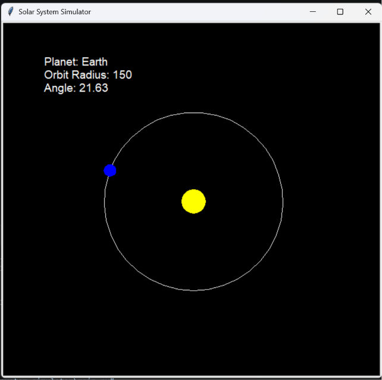
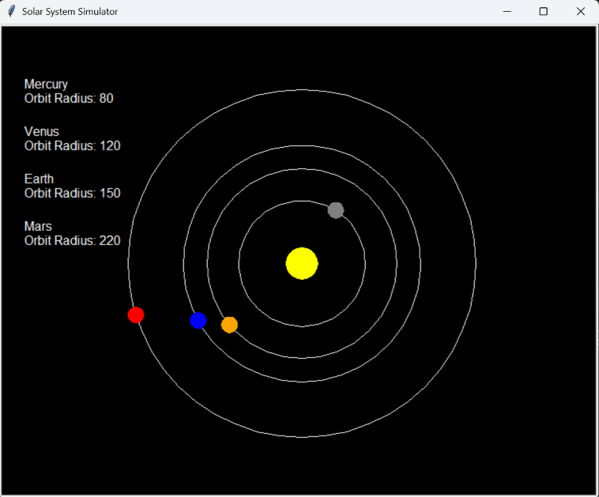
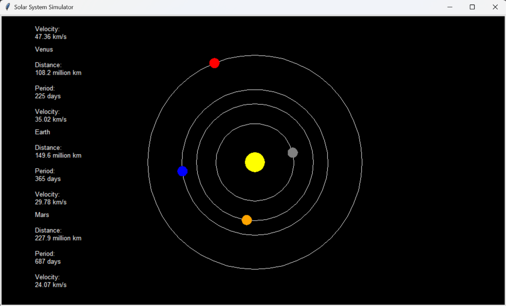
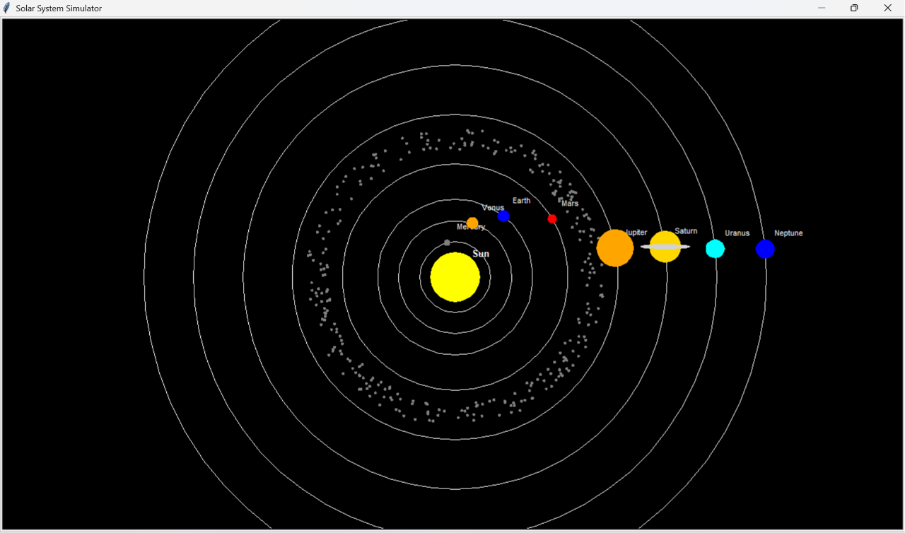

# 🌍 Solar System Simulator

> A Python-based astrophysics project that visualizes planetary motion and explores the mathematics, physics, and computational principles governing our Solar System.

## 🚀 About the Project

The Solar System Simulator is a personal project developed as part of my journey into **Python programming**, **Astrophysics**, and **Scientific Computing**.

The project began with a simple Earth orbit simulation and is gradually evolving into a complete interactive Solar System model. Through this project, I aim to better understand orbital mechanics, trigonometry, object-oriented programming, simulation design, and real-world astronomical concepts.

As development progresses, new features are added incrementally, allowing the project to serve both as a learning experience and as a practical demonstration of scientific visualization using Python.

---

## 📈 Current Progress

### Version 1: Earth Orbit Simulation ✅

* Repository Setup
* GitHub Integration
* Sun Created Using Turtle Graphics
* Earth Object
* Orbit Path
* Earth Orbit Animation

### Version 2: Multi-Planet Simulation ✅

* Planet Class (OOP)
* Mercury Added
* Venus Added
* Earth Added
* Mars Added
* Multiple Orbit Paths
* Planet Information Display

### Version 3: Planetary Data System ✅

* Distance from Sun Data
* Orbital Period Data
* Orbital Velocity Data
* Planetary Information Integration
* Improved Data Presentation

### Version 4.0: Complete Solar System ✅

* Jupiter Added
* Saturn Added
* Uranus Added
* Neptune Added
* Complete Eight-Planet Solar System
* Saturn Ring System

### Version 4.1: Visual Improvements ✅

* Enhanced Saturn Rings
* Improved Visual Design
* Better Layout and Positioning

### Version 4.2: Asteroid Belt Simulation ✅

* Animated Asteroid Belt
* Hundreds of Individual Asteroids
* Randomized Orbital Speeds
* Real-Time Belt Motion

### Version 4.3: Interactive Solar System ✅

* Planet Hover Detection
* Click-to-Select System
* Interactive Information Panel
* Sun Information Panel
* Zoom Controls
* Pause / Resume Functionality
* Responsive User Interface
* Dynamic Layout Management

## Technologies Used

* Python
* Turtle Graphics
* Tkinter
* Object-Oriented Programming (OOP)
* Event-Driven Programming
* Trigonometry
* Git
* GitHub

---

## 🧠 Concepts Explored

* Object-Oriented Programming
* Trigonometry
* Circular Motion
* Orbital Motion
* Event Handling
* User Interface Design
* Scientific Visualization
* Astrophysics Fundamentals
* Simulation Design
* Software Development Workflow

---

## 🗺 Project Roadmap

### Version 5: Educational Visualization & Controls

### Version 5.1 — Enhanced Visualization

* Planet Labels Following Planet Motion
* Planet Orbital Trails
* Improved Planet Rendering
* Improved Saturn Ring System
* Enhanced Background Effects

### Version 5.2 — Interactive Controls

* Orbital Speed Controller
* Simulation Time Scaling
* Speed Presets
* Improved Pause / Resume System
* User Control Panel

### Version 5.3 — Astrophysics Features

* Habitable Zone Visualization
* Kepler's Third Law Demonstration
* Planet Classification Display
* Solar System Scale Information
* Educational Information Expansion

### Version 5.4 — Advanced Exploration Mode

* Distance Measurement Tool
* Planet Comparison System
* Focus-On-Planet Mode
* Dynamic Planet Statistics
* Solar System Exploration Interface

### Version 5.5 — User Experience Improvements

* Improved Information Panels
* Better UI Layout
* Enhanced Hover Effects
* Smooth Animations
* Improved Navigation and Controls

### Version 6

* Improved Physics Model
* Enhanced Graphics
* More Realistic Orbital Motion

### Version 7

* Web-Based Interactive Simulator
* Modern User Interface
* Real Astronomical Data Integration
* Advanced Astrophysics Features

---

## 🔭 Future Goals

* Interactive Solar System Exploration
* Dynamic Asteroid Belt
* Planet Information Panels
* Habitable Zone Visualization
* Kepler's Laws Demonstration
* Exoplanet Simulation Mode
* NASA Data Integration
* Improved Scientific Accuracy
* Enhanced Graphics and Realism
* Web Deployment

---

## 📸 Screenshots

### Version 1 — Earth Orbit Simulation

### Version 2 — Multi-Planet Simulation

### Version 3 — Planetary Data Integration

### Version 4.1 — Complete Solar System Expansion

### Version 4.2 - Movement of Asteroid Belt

---

## 👨‍💻 Author

**Abhishta Gyanda**

Computer Science Engineering Student
Delhi Technological University (DTU)

### Areas of Interest

* 🌌 Astrophysics
* 🚀 Space Exploration
* 💻 Software Development
* 🔬 Scientific Computing
* 🛰 Space Technology

---

> *“We are all made of star-stuff.”* — Carl Sagan

